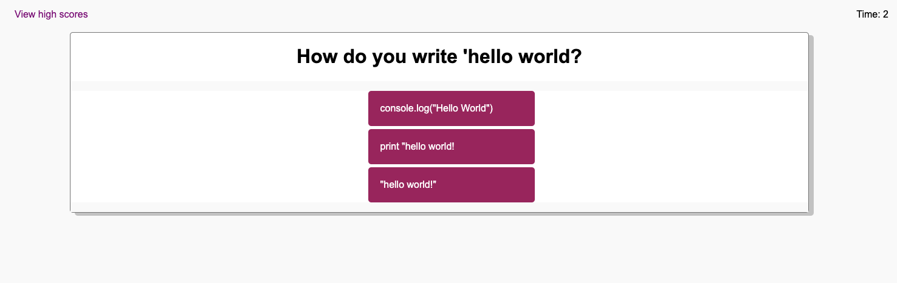

# code-quiz

## Descrtipton

The purpose of this class homework was to create a timed code quiz that presents the user with several questions. Users will earn points for each qusetion answered correctly and time will be docked for any wrong answers. Users will be able to view and input their high score at the very end. 

Concepts covered during this class were: 
- manipulating the DOM using Vanilla Javascript. 
- using local storage to set and get the high score along with user initials

